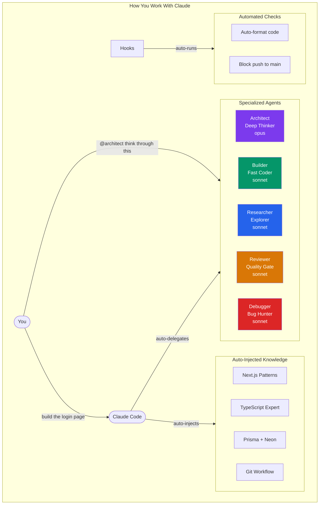
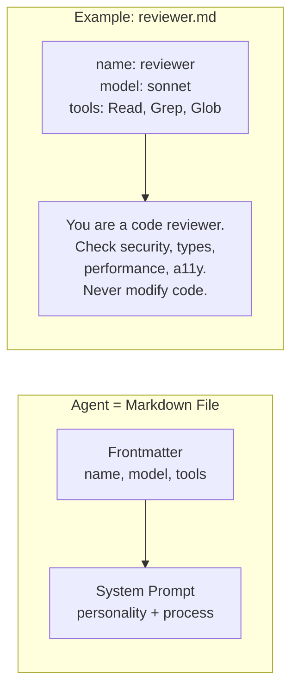
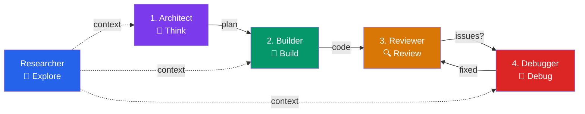
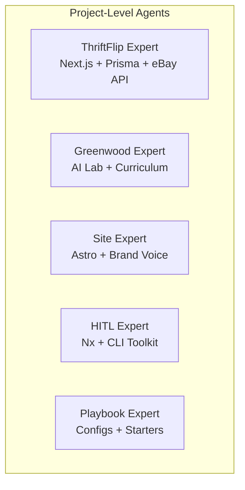
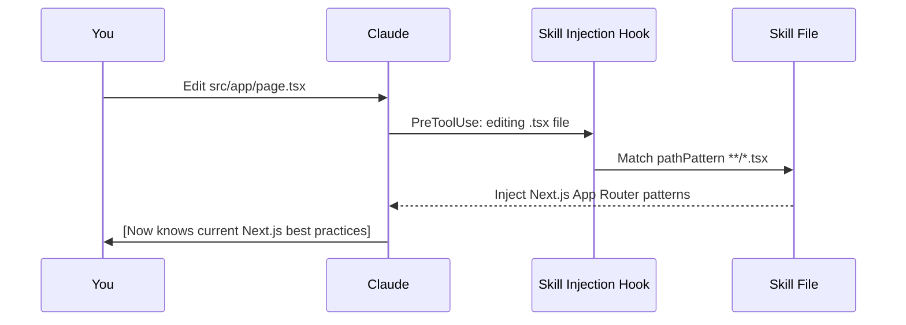

# The Agent System: How It Works

A walkthrough of a real Claude Code configuration — 16 specialized agents, 25 skills, and automated hooks — built by one person using Claude itself.

This is what AI-augmented development looks like in practice. Everything here was designed and written conversationally with Claude Code. Staff can do the same.

---

## The Big Picture



---

## What Are Agents?

Agents are **specialized assistants** that Claude delegates to when a task matches their expertise. Each one has:

| Property          | What It Controls            | Example                                           |
| ----------------- | --------------------------- | ------------------------------------------------- |
| **Model**         | How smart/fast/expensive    | `opus` for deep thinking, `haiku` for quick chat  |
| **Tools**         | What it can access          | Read-only for reviewers, full access for builders |
| **System Prompt** | Its personality and process | Step-by-step instructions for how to work         |
| **Description**   | When it activates           | "Use when the user says 'review this code'"       |

Think of it like building a team. Each member has a role, a set of permissions, and a way of working.



---

## The Agent Roster

### Work Mode Agents

These handle different phases of development work.



| Agent          | Model           | Access           | What It Does                                                         |
| -------------- | --------------- | ---------------- | -------------------------------------------------------------------- |
| **Architect**  | opus (smartest) | Read-only        | Thinks through design decisions, produces Mermaid diagrams and plans |
| **Builder**    | sonnet (fast)   | Full access      | Writes code following specs, runs tests, verifies                    |
| **Researcher** | sonnet          | Read-only + web  | Explores codebases, looks up docs, investigates questions            |
| **Reviewer**   | sonnet          | Read-only        | Code review checklist — security, types, performance, accessibility  |
| **Debugger**   | sonnet          | Read + run tests | Traces bugs to root causes, proposes minimal fixes                   |

### Meta Agents (Build More Agents)

| Agent               | What It Does                                            |
| ------------------- | ------------------------------------------------------- |
| **Skill Architect** | Designs and writes new skills (auto-injected knowledge) |
| **Agent Architect** | Designs and writes new agents                           |

### Project Experts

Each project gets its own expert agent that knows the architecture, conventions, and goals.



### Fun Agents (Yes, Really)

| Agent           | Model            | What It Does                                            |
| --------------- | ---------------- | ------------------------------------------------------- |
| **Philosopher** | opus             | Thinking buddy for big ideas and deep conversations     |
| **Sci-Fi**      | sonnet           | Book/movie/show recommendations and discussions         |
| **Anime Buddy** | sonnet           | Tracks your watch list, gives personalized recs         |
| **Storyteller** | sonnet           | Writes conference talks, blog posts in your voice       |
| **Rubber Duck** | haiku (cheapest) | Just asks questions to help you think. No tools at all. |

---

## What Are Skills?

Skills are **knowledge packets** that Claude auto-injects when you're working in a relevant context. You don't call them — they just appear when needed.



Example: when you edit a `.prisma` file, the Prisma + Neon skill automatically injects — so Claude knows to use `@neondatabase/serverless`, not the deprecated `@vercel/postgres`.

---

## How Staff Would Use This

### Day 1: Clone and Go

```bash
# Copy a role-based starter
cp starters/manager.md ~/.claude/CLAUDE.md

# Start working — that's it
claude
```

### Week 1: Customize with Claude's Help

```
You: @agent-architect create an agent for writing project briefs
Claude: [writes the agent file, saves it, ready to use]

You: @skill-architect create a skill for our internal API conventions
Claude: [writes the skill file with the right patterns]
```

### Ongoing: Claude Maintains the System

Every agent and skill is a markdown file. To change one:

- Edit it directly on GitHub (click any file → pencil icon)
- Or tell Claude: "update the reviewer agent to also check for accessibility"
- Claude reads the file, makes the change, done

**No code required. No deployments. Just markdown files and conversation.**

---

## For Greenwood Staff: Getting Started

1. **Browse the [Agent Catalog](agent-catalog.md)** — see what's possible
2. **Pick a starter** from `starters/` that matches your role
3. **Ask Claude to build agents** for your specific workflows
4. **Share what works** — agents and skills are just files that can be copied across teams

The system grows organically. Start with the basics, add agents as you discover repetitive patterns in your work.

---

## File Structure (It's Just Markdown)

```
~/.claude/
├── CLAUDE.md                  ← Your working standards (like a team handbook)
├── settings.json              ← Permissions, hooks, plugins
├── agents/                    ← Your specialized assistants
│   ├── architect.md           ← Each agent = one markdown file
│   ├── builder.md
│   ├── reviewer.md
│   └── ...
└── skills/                    ← Auto-injected knowledge
    ├── next-app-router/
    │   └── SKILL.md           ← Each skill = one markdown file
    ├── prisma-neon/
    │   └── SKILL.md
    └── ...
```

Everything is version-controlled. Everything is readable. Everything is editable with Claude or by hand.
